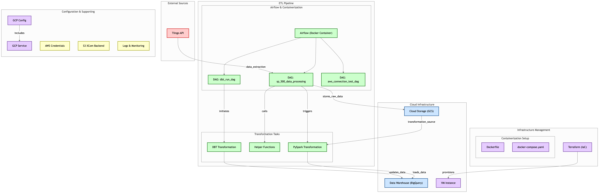
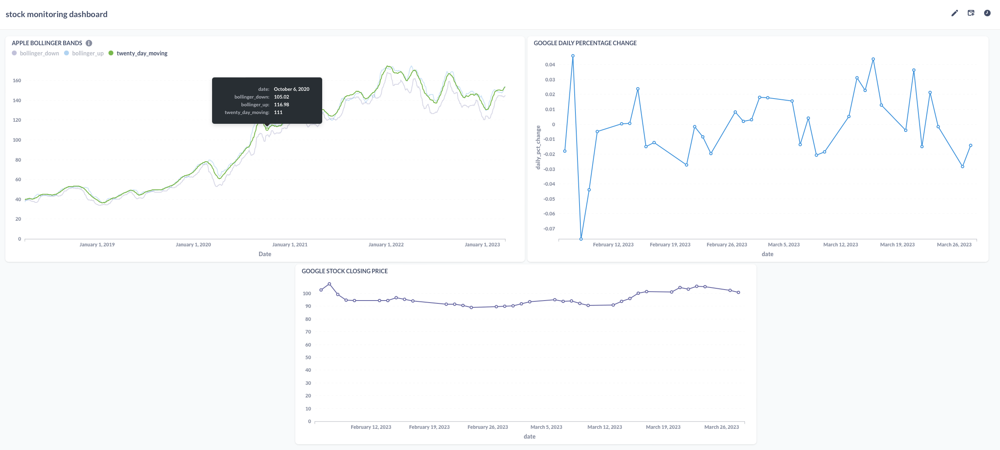
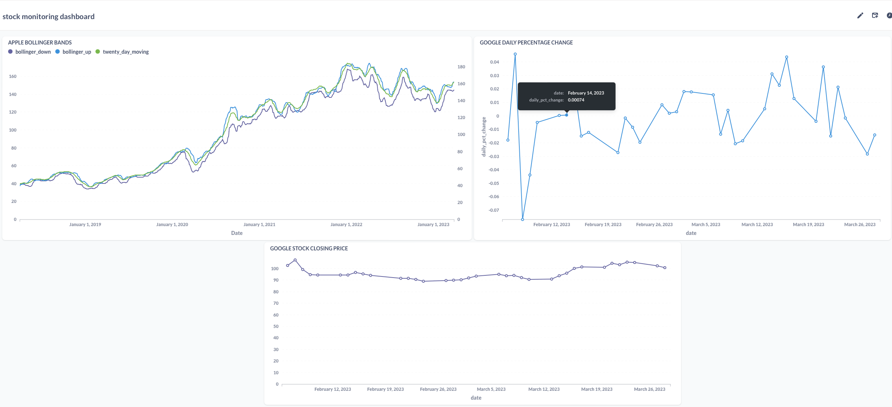
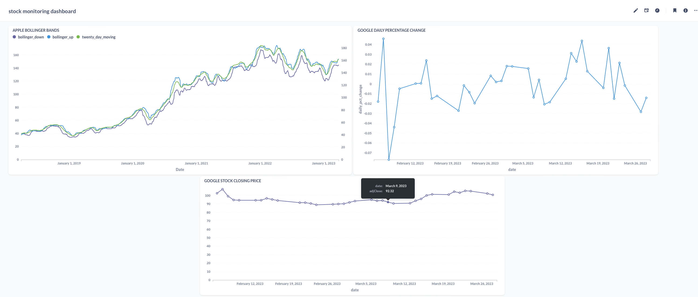

# Project about 
This project is aimed at processing sp500 stock data to support decision making.
The transformation steps taken enrich the dataset to facilitate the use of financial indicators to support business decision making by utilizing the dashboard developed in data studio.

## System Architecture


## Pipeline Overview
The data pipeline consists of several stages for processing SP500 stock data:




## Dataset
[The stock data used is gotten from the tiingo api](https://api.tiingo.com/)

## Technologies
- **Google cloud platform** (GCP):
  - VM Instance to run project on it.
  - Cloud Storage to store raw and processed data.
  - BigQuery as data source for dashboard.
- **Terraform** to create cloud infrastructure.
- **Airflow** to run data pipelines as DAGs.
- **PySpark** to transform raw data.
- **Google data studio** to visualize data.

# Results 
## Cloud infrastructure
Except the VM Instance, all project infra setups with terraform: 
- Data Lake for all of the project data.
- BigQuery for transformed data tables as source for dashboard.

## Data pipelines
The data is downloaded from the tiingo api and then transformed and uploaded to cloud storage via Airflow DAGs:
1. **sp 500 data processing DAG** 
  - The dag handles the extraction of sp 500 stock daa from the tiingo api.
  - The upload to gcs task uploads the extracted data to GCS.
  - The transform data task uses stored data in GCS and transforms the data using pyspark.
  - The ingest data into bigquery task uploads the transformed data to BigQuery.
# Airflow DAGs

To run Airflow, you'll need to set up a Docker Compose network. The necessary files and specifications are included in this repository:

- `Dockerfile`, `docker-compose.yaml` and `requirements.txt` files contain everything you need to run Airflow in Docker containers.

- `.env` You'll need to update the `.env`file with your GCP and Airflow credentials before building Docker images.

- **dag**  directory contains the code for the DAGs and necessary scripts:
    - **sp_500_data_processing_dag.py**.  defines the DAG for processing stock data with a `dag_id` "SP_500_DATA_PIPELINE_v1".
    - **helper_functions.py** contains helper functions for stock data processing operations.
    - **stock_data_transform.py** contains the Spark transformation function.

#### How to run
1. Copy the`airflow` directory from this repository to your local machine.
2. Create directories for logs, plugins, and credentials in the  `/airflow` directory::
```
mkdir -p ./logs ./plugins ./creds
cd creds
In the creds directory, create a file named s3 and add your AWS credentials in the following format:
```
[airflow-xcoms]
aws_access_key_id = 
aws_secret_access_key = 
```
3. Edit `.env` file with your credits: 
- `GCP_PROJECT_ID`
- `GCP_GCS_BUCKET`

4. Build Docker images:
For this i have made use of a make file to streamline your operations

```
make build 
```
5. Start Docker containers:
```
make up
```
6. To stop running containers:
```
make down
```
7. Once Airflow is running, you can access it on port 8080. You can forward this port and open it in your browser at localhost:8080.


## Prereqs
- Anaconda
- Docker + Docker-compose
- GCP project
- Terraform

## Setup & Deploy
1. Create cloud infrasctructure via Terraform. Look at instructions at [terraform dir](https://github.com/falowo95/sp500_ETL_Pipeline/tree/main/terraform).
2. Run Airflow in docker and trigger DAGs. Look at instructions at [airflow dir](https://github.com/falowo95/sp500_ETL_Pipeline/tree/main/airflow).
3. Connect Google Data Studio dashboard to project BigQuery as a source.


