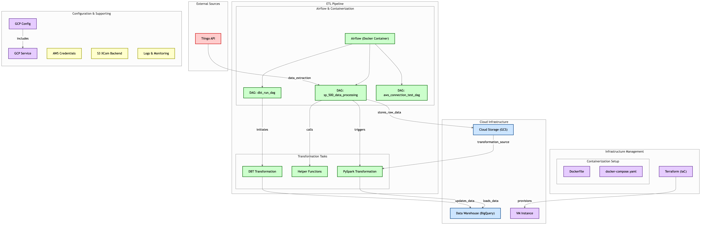
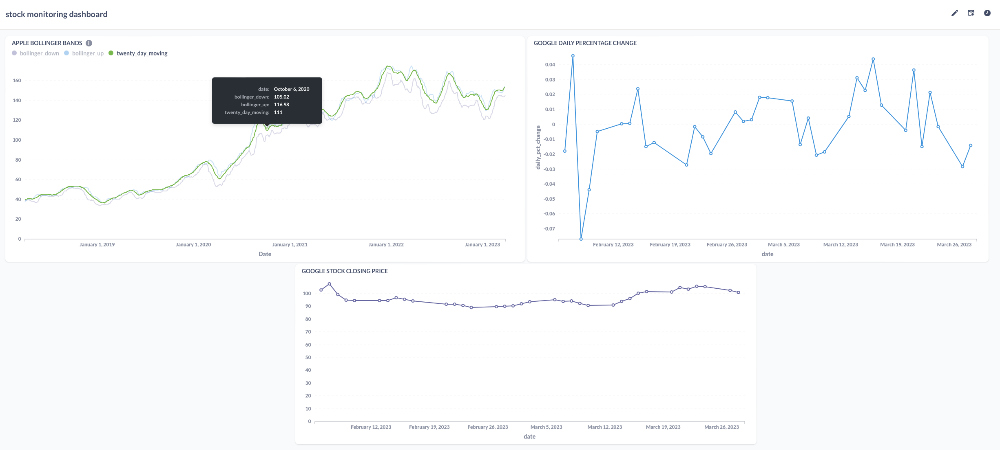
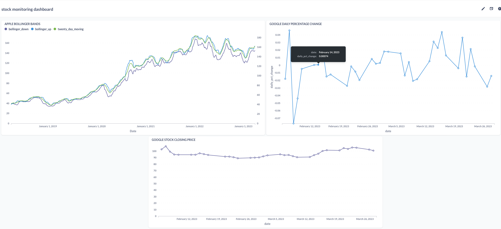
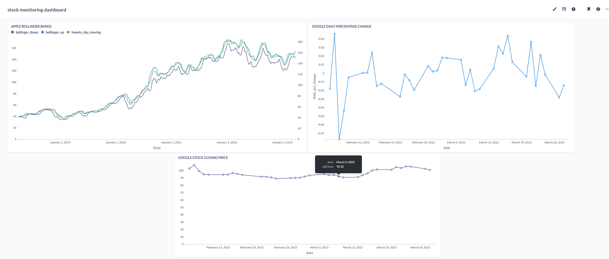

# SP500 ETL Pipeline

An end-to-end data pipeline that extracts daily S&P 500 stock data, lands it in
BigQuery, and computes technical indicators (moving averages, RSI, MACD, Bollinger
bands) with dbt — orchestrated by Airflow, provisioned with Terraform, built entirely
on Google Cloud Platform.

## Architecture

```
Tiingo API
   │  (per-ticker daily OHLCV)
   ▼
extract_data_task ──▶ ingest_to_gcs ──▶ transform_data_task ──▶ ingest_data_into_bigquery ──▶ dbt_build
  (pandas)            (raw CSV to GCS)   (PySpark: clean/cast)   (load to BigQuery)          (dbt on BigQuery)
```

One Airflow DAG (`SP_500_DATA_PIPELINE_v1`), five chained tasks:

1. **Extract** — pulls daily OHLCV data for every S&P 500 ticker from the
   [Tiingo API](https://api.tiingo.com/).
2. **Load to GCS** — uploads the raw CSV to Cloud Storage.
3. **Clean** — PySpark casts types and sorts the data; it does **not** compute
   indicators (see below).
4. **Load to BigQuery** — loads the cleaned data into a BigQuery table.
5. **dbt build** — runs the dbt project (staging → intermediate → marts) against
   BigQuery, computing every derived metric in SQL: daily % change, MA20/MA50/MA200,
   Bollinger bands, RSI, a moving-average-based MACD approximation, and trading
   signals (trend/RSI/MACD/Bollinger).

Indicator math intentionally lives in **one place** (dbt/SQL), not split between
PySpark and SQL — see the comment in
[`int_stock_daily_metrics.sql`](dags/dbt/dbt_sp500/models/intermediate/int_stock_daily_metrics.sql)
for the one documented trade-off (MACD is SMA-approximated, since BigQuery Standard
SQL has no recursive CTEs for a true EWMA).

## Screenshots






## Tech stack (GCP-only)

| Concern | Tool |
|---|---|
| Orchestration | Apache Airflow (Docker Compose) |
| Extraction | Python + pandas (Tiingo API) |
| Cleaning | PySpark |
| Storage | Google Cloud Storage |
| Warehouse | BigQuery |
| Transformation | dbt (`dbt-bigquery`) |
| Secrets | GCP Secret Manager |
| Infrastructure | Terraform |
| Dashboard | Google Data Studio (Looker Studio) |

## Setup

### Prerequisites
- Docker + Docker Compose
- A GCP project with Cloud Storage, BigQuery, and Secret Manager APIs enabled
- Terraform
- Application Default Credentials configured locally (`gcloud auth application-default login`)
  or a service account key for CI/production — **never commit credential files**;
  see `.gitignore`.

### Environment variables
| Variable | Used by | Purpose |
|---|---|---|
| `GCP_PROJECT_ID` | Airflow config, dbt | GCP project ID |
| `GCP_GCS_BUCKET` | Airflow config | Data lake bucket name |
| `GCP_BQ_DATASET` | dbt | BigQuery dataset (defaults to `SP_500_DATA`) |
| `GOOGLE_APPLICATION_CREDENTIALS` | GCS/BigQuery clients | Path to ADC/service-account credentials |

The Tiingo API key is **not** an env var — it's read from GCP Secret Manager at
task-execution time (secret name `api-tiingo`), so it's never in an env file or
Airflow log. See [`gcp_secret_manager.py`](dags/config/gcp_secret_manager.py).

### Run it

```bash
# 1. Provision infrastructure
make tf-init
make infra-up

# 2. Store the Tiingo API key in Secret Manager
gcloud secrets create api-tiingo --data-file=- <<< "your-tiingo-key"

# 3. Start Airflow
make build
make up
```

Airflow UI: `http://localhost:8080`.

## Testing

```bash
pip install -r requirements.txt
pytest -v
```

Covers: GCP client singleton behavior (mocked), `ETLConfig` property resolution
(regression-tests the bug class where a lazily-resolved config value was defined as
a plain method but read as a bare attribute), and Airflow `DagBag` import integrity
(fails fast if a DAG can't parse). CI runs the same suite plus lint and a best-effort
`dbt parse` on every push — see [`.github/workflows/ci.yml`](.github/workflows/ci.yml).

## Project layout

```
dags/
├── sp_500_data_processing_dag.py   # the one pipeline DAG
├── helper_functions.py             # extract / GCS upload / BigQuery load
├── stock_data_transform.py         # PySpark cleaning
├── config/                         # ETLConfig, GCP client singletons, Secret Manager
└── dbt/dbt_sp500/                  # staging → intermediate → marts
terraform/                          # GCS bucket + BigQuery dataset
tests/
docker-compose.yaml
```
